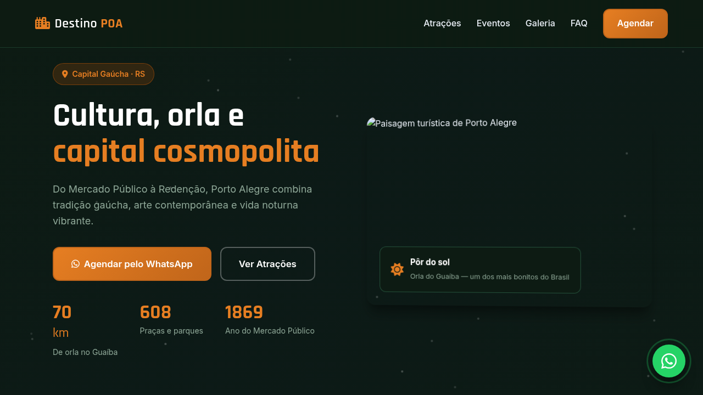
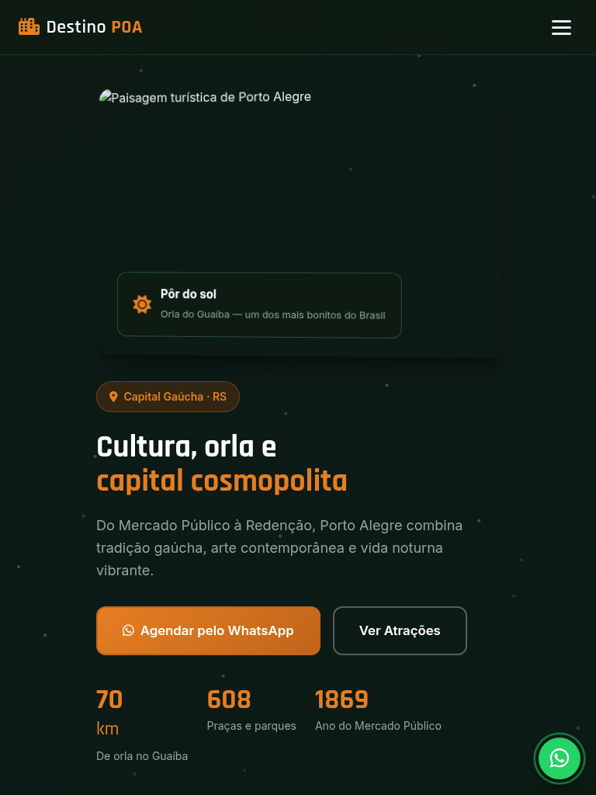
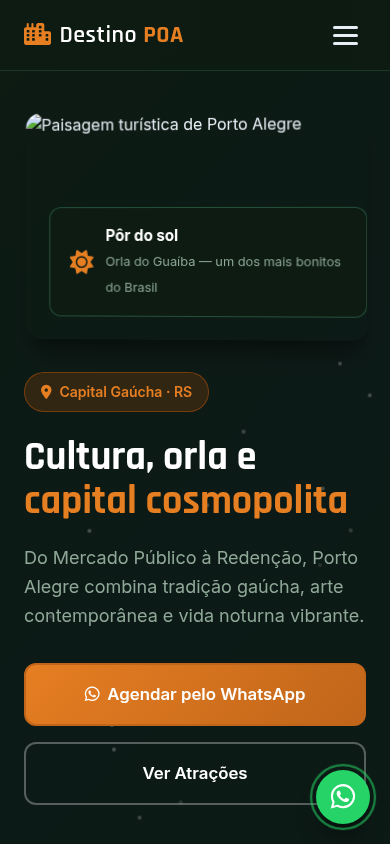

# Porto Alegre — Landing Page de Turismo

Landing page de alta conversão para turismo em **Porto Alegre** (Capital Gaúcha · RS), com atrações autênticas, eventos locais, galeria visual e agendamento estruturado via WhatsApp.

[](https://tofariasti.github.io/turismo-porto-alegre/)

## Demo

**Moldura (preview):** [https://tofariasti.github.io/turismo-porto-alegre/](https://tofariasti.github.io/turismo-porto-alegre/)

**Tela cheia:** [https://tofariasti.github.io/turismo-porto-alegre/site/](https://tofariasti.github.io/turismo-porto-alegre/site/)

## Screenshots

### Desktop (1280px)


### Tablet (768px)


### Mobile (390px)


## Funcionalidades

- Design responsivo mobile-first com identidade visual regional
- Integração WhatsApp com formulário para agendar visita (nome, data, pessoas, roteiro)
- Animações AOS, partículas no hero, contadores e hover nos cards
- Seções: Hero, Como funciona, Atrações, Eventos, Galeria, FAQ e Contato
- Botão flutuante WhatsApp com pulse
- Acessibilidade: skip link, ARIA, contraste, foco visível, alt text
- Respeita `prefers-reduced-motion`
- Moldura iframe com preview desktop/tablet/mobile

## Pontos turísticos destacados

- **Orla do Guaíba** — Ciclovia, mirantes, bares e o famoso pôr do sol — revitalizada pós-2024.
- **Mercado Público** — Mais de 100 lojas com gastronomia, artesanato e produtos típicos desde 1869.
- **Parque Farroupilha (Redenção)** — Feira de antiguidades aos domingos, chimarrão e vida ao ar livre.
- **Fundação Iberê Camargo** — Museu de arte contemporânea projetado por Álvaro Siza às margens do Guaíba.
- **Cais Embarcadero** — Antigos armazéns revitalizados com gastronomia, cultura e vista para o lago.
- **Casa de Cultura Mário Quintana** — Antigo Hotel Majestic transformado em centro cultural no Centro Histórico.

## Eventos

- **Feira do Livro de POA** (Nov) — Uma das maiores feiras literárias do país no Auditório Araújo Vianna.
- **Acampamento Farroupilha** (Set) — Semana Farroupilha com CTGs, gastronomia e tradições no Parque da Harmonia.
- **Porto Alegre em Cena** (Ano todo) — Festival de artes cênicas com teatro, dança e música.
- **Agenda Destino POA** (Verão) — Shows, festivais e eventos ao ar livre na orla e parques.

## Tecnologias

- HTML5 semântico · CSS3 · JavaScript vanilla
- AOS 2.3.4 · Font Awesome 6.4 · Google Fonts (Rajdhani + Inter)

## Screenshots (geração)

```bash
python3 -m http.server 8765
npm install
npm run screenshots
```

## Repositório

https://github.com/tofariasti/turismo-porto-alegre

## Autor

**Tiago O. de Farias** — [Farias Digital](https://fariasdigital.com.br/)

---

<p align="center">
  <a href="https://tofariasti.github.io/turismo-porto-alegre/">🌐 Demo Online</a> ·
  <a href="https://fariasdigital.com.br/">🏢 Site Comercial</a>
</p>
